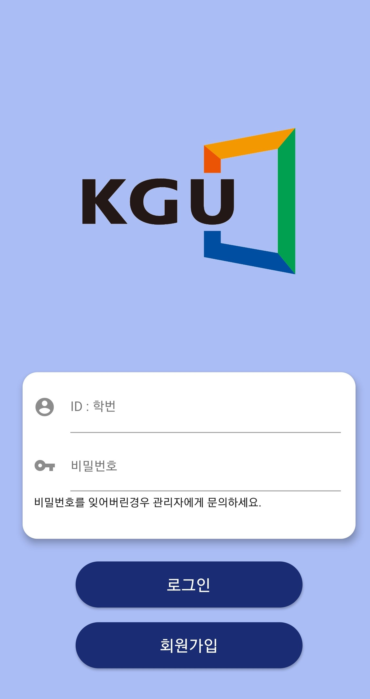

# 경기대학교소성박물관 - 학교 밖 수원을 보다 APP

    현재 프로젝트는 모두 구현되었으나 COVID-19로 인해 일시적 중지되었으며, 이후 유지보수 및 응용확장을
    위해 이어나갈 개발자를 구하고 있습니다. 관심있으신 경기대학교 재학생은 아래 연락처로 연락바랍니다.

# 프로젝트명 - "학교 밖 수원을 보다"

    본 프로젝트는 컴퓨터공학부 복수전공생 4명이 경기대학교 소성박물관과 함께 진행한 프로젝트입니다.

## 프로젝트 개요
### 소성박물관 비교과 프로그램
 - "학교 밖 수원을 보다" 프로그램은 경기대학교 소성박물관에서 주최하는 비교과 프로그램으로 경기대학교와 주변 박물관들을 연결한 Suwon Museum Belt를 학생들이 이용할 수 있도록 박물관을 방문하고 도장을 받아 소감과 함께 제출하는 프로그램이다. 

### 개발배경 및 작품 소개
- 기존 활동 방법은 활동 수첩에 도장을 찍기 위해 방물관마다 불필요한 대면 접촉이 발생된다. 또한 프로그램 이수 처리를 위해 모든 활동 수첩을 담당자가 일일이 검토하고 기록해야하는 비효율적인 업무 진행 개선이 필요하다. 따라 이를 모두 전산화하여 프로그램 활동과 업무 진행을 개선한다.

### 사용 기술
- Django, Flutter, HTTP, Restful, JWT(Json Web Token)

</img>

---
## APP UI/UX
</img> 

---

## Developrer

선태욱 seon1346@kyonggi.ac.kr

- Server : Django, Admin-Web, AWS 

남은우 201512285@kyonggi.ac.kr

- Server : Django, Restful, JWT, Flutter, Admin-APP

편준장 jjp2548@kyonggi.ac.kr

- APP : Flutter, UX/UI, Packaging

우현경 dnjsm77@kyonggi.ac.kr

- APP : Flutter, UX/UI, Packaging

---

## Git

Server(django)

- https://github.com/ewooooo/DoubleCulture

App(flutter) 

- https://github.com/ewooooo/DoubleCultureAPP

